# **Web-based Smart Attendance System Using Machine Learning**

[](https://www.python.org/)
[](https://www.tensorflow.org/)
[](https://flask.palletsprojects.com/)
[](https://www.mongodb.com/)
[](LICENSE)

An intelligent, automated attendance system leveraging facial recognition technology to eliminate manual attendance tracking. Built with Python, OpenCV, and deep learning, this system achieves approximately 85% accuracy under optimal lighting conditions. The system supports multiple subjects/lectures and integrates with MongoDB for robust data management.

**Author:** Tushar Sharma  
**Repository:** [tusharsharma20021114/rgbWeb-based-Smart-attendence-system-using-ML](https://github.com/tusharsharma20021114/rgbWeb-based-Smart-attendence-system-using-ML)

---


This is the overview of the UI


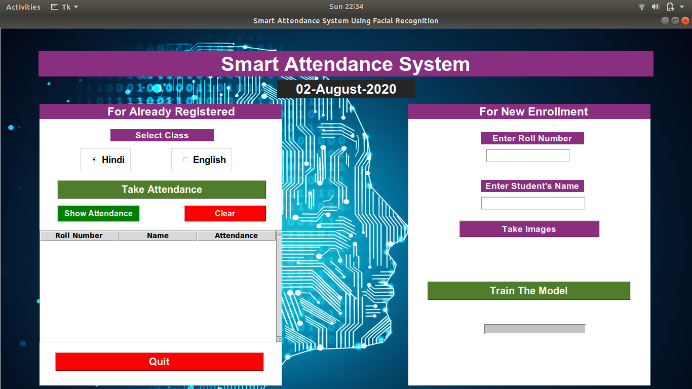

The project is divided into the following sections:
1. Generating Training data/ Students pic and enrolling them in MongoDB database in all the collections(Hindi and English)_and a CSV file named Students Enrollment
2. Once the required dataset is generated the model is trained which comprises of several layers with softmax in the output layer** (I have not used any regularization as such as the model was giving good response in normal lightning conditions however it can be used if we have too many classes/students)
3. The user can then select the required lecture (English and Hindi) and check the existing attendance 
4. The user can then take the attendance by clicking on the required button. It takes approximately 15 seconds to start the attendance window. (The attendance is stored in MongoDB database and separate collections are created for English and Hindi classes to avoid overlaps)
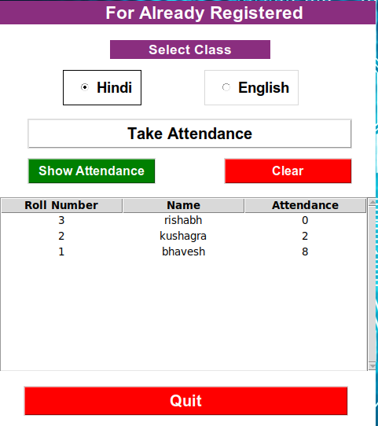


## **Features**

- ✅ Real-time face detection and recognition using OpenCV and Haar Cascade
- ✅ Deep learning model with FaceNet embeddings for accurate face recognition
- ✅ MongoDB integration for persistent data storage
- ✅ Multi-subject support (easily extensible)
- ✅ Automated student enrollment with image capture
- ✅ CSV export functionality for attendance records
- ✅ Multiple UI options: Desktop GUI (Tkinter) and Web Interface (Flask)
- ✅ RESTful API for third-party integrations
- ✅ Progress tracking for model training
- ✅ Modern, responsive design with enhanced styling
- ✅ Real-time statistics dashboard

## **Technology Stack**

- **Backend:** Python 3.x, Flask
- **Computer Vision:** OpenCV, Haar Cascade Classifier
- **Deep Learning:** Keras/TensorFlow, FaceNet
- **Database:** MongoDB, Pymongo
- **Frontend:** HTML5, CSS3, JavaScript (for web interface)
- **Desktop GUI:** Tkinter
- **Data Processing:** Pandas, NumPy
- **API:** Flask-CORS for cross-origin requests

## **Prerequisites**

Install the required packages from the Requirements folder based on your system:
- `requirements.txt` - Main dependencies (recommended)
- `CPU_Req.txt` - For CPU-based systems
- `GPU_Req.txt` - For GPU-accelerated systems

```bash
pip install -r requirements.txt
# OR for GPU systems
pip install -r Requirements/GPU_Req.txt
```

**Additional Requirements:**
- Python 3.7 or higher
- MongoDB installed and running locally on port 27017
- Webcam for capturing images
- Pre-trained FaceNet model (facenet_keras.h5)
- Haar Cascade XML file for face detection

## **Installation & Setup**

1. Clone the repository:
```bash
git clone https://github.com/tusharsharma20021114/rgbWeb-based-Smart-attendence-system-using-ML.git
cd rgbWeb-based-Smart-attendence-system-using-ML
```

2. Install dependencies:
```bash
pip install -r requirements.txt
# OR for specific system requirements
pip install -r Requirements/CPU_Req.txt
```

3. Ensure MongoDB is running:
```bash
sudo systemctl start mongodb
# OR
mongod
```

4. Run the application:

**Option A - Desktop GUI (Tkinter):**
```bash
python3 UI.py
# OR modern styled version
python3 UI_modern.py
```

**Option B - Web Interface (Flask):**
```bash
python3 app_web.py
# Access at http://localhost:5000
```

**Option C - REST API Only:**
```bash
python3 api.py
# API available at http://localhost:5000/api
```

## **How to Use**

**Important:** Students must be enrolled sequentially starting from Roll Number 1. Avoid duplicate roll numbers.

### Step 1: Launch the Application
Run the main UI:
```bash
python3 UI.py
```
### Step 2: Enroll New Students
Use the right-hand section for new enrollments. Students are automatically enrolled in all subjects with 0 attendance.

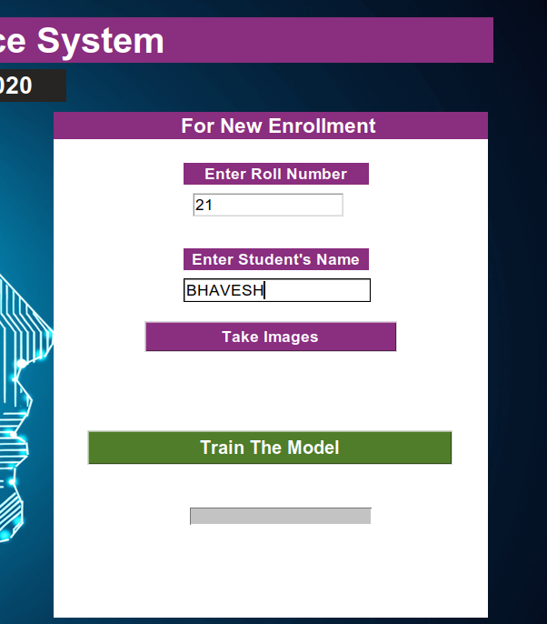

### Step 3: Capture Student Images
Click "Take Images" - a window opens and captures 30+ images of the detected face for training data.

### Step 4: Verify Enrollment
Check `Students_Enrollment.csv` to verify student enrollment.


### Step 5: Train the Model
Click "Train The Model". The system uses multi-threading for efficient training with a progress bar.

### Step 6: Model Training Complete
The model trains in the background and saves to `Model/Face_recognition.MODEL`.
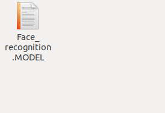

### Step 7: Take Attendance
Navigate to the left section and select the desired lecture (English/Hindi).

### Step 8: Check Existing Attendance
Click "Show Attendance" to view current attendance records. Use "Clear" to reset the display.

### Step 9: Mark Attendance
Select the lecture and click "Take Attendance".


### Step 10: Recognition Process
The system takes ~15 seconds to initialize and opens a recognition window.

### Step 11: Automatic Recognition
The system recognizes faces and marks attendance automatically (once per student per session).

### Step 12: View Updated Records
Click "Show Attendance" to see the updated attendance for the selected lecture.
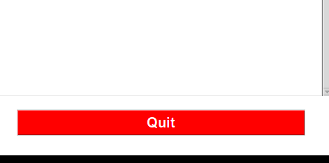

### Step 13: Data Storage
Attendance is stored in both MongoDB and CSV files in the respective subject directories.

### Step 14: Exit
Click "Quit" to close the application.


## **Project Architecture** 

### **1. Dataset Generation & Student Enrollment**

1. The student's input is taken from the Tkinter UI using a text field and a function is called in Generate_Dataset.py file. The code pops up a window frame.<br/>
2. As soon as the user inputs the details (Name and Roll Number) the data is saved in the MongoDB database using Pymongo<br/>
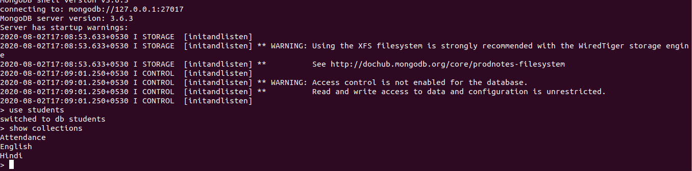<br/>

3. The students are enrolled in both the subjects with 0 Attendance in the function PushMongo.<br/>
4. After the students are enrolled in Mongo they are appended in a CSV file "Student_Enrollment.CSV"(This file is important as the number of classes in Recognizer are derived from here)<br/>
5. Then, the names folders/directories are created in the people folder with "roll number"+"name" format<br/>

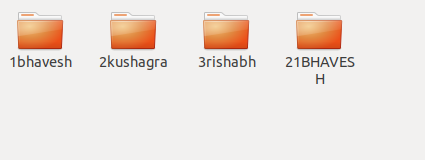<br/>
6. Faces of students are detected in real-time using Harcascade classifier in OpenCV2 (Faces.xml)<br/>
7. The pictures are stored in increasing digits order( 30 Pictures per person are taken as of now)<br/>

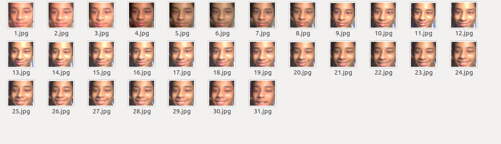<br/>

8. After taking 30 images the window(frame) is automatically destroyed<br/>
9. Following the above steps, new students can be enrolled<br/>


### **2. Model Training Pipeline**

1. After taking pictures of the desired students now you can click on Train the model Button<br/>
2. The control is shifted to ModelTraining() function in Model_train.py<br/>
3. Number of classes are then calculated by reading the Student_Enrollment.csv using pandas and calculating the shape[0]<br/>
4. Learning rate is set to 0.01, epochs to 400 and batch_size to 16, hyperparameters can be further tweaked for better performance<br/>
5. Then the folders from People folder are sorted and read to extract the images<br/>
6. Images are resized to (160,160) then embeddings are extracted using pre-trained model "facenet_keras.h5"<br/>
7. The embeddings are appended to a list and then converted to NumPy array for Training<br/>
8. I have used Adam optimizer and the following are the layers:
	1. Input layer 128 Neurons followed by Relu Activation
	2. 3 Hidden layers with 64, 32 and 16 neurons respectively
	3. Output Layer with Softmax Activation<br/>
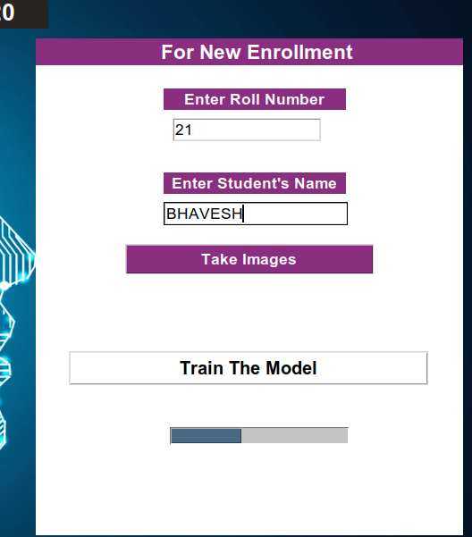<br/>
9. The model takes around 30-40 seconds for training and saved as "Face_recoginition. Model" in the Model directory<br/>
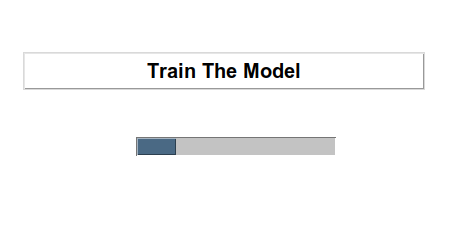<br/>


### **3. Face Recognition & Attendance Marking**
1. On clicking the class (Hindi/English) Radiobutton, you can click on Take attendance
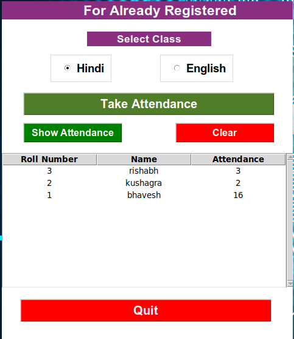<br/>

2. The control is shifted to Recognition() function in Recognizer.py
3. The labels are created in a dictionary with value 0 for all the names of students(names are extracted from people folder)
4. Then a window is popped which detects the face in realtime with the same CV2 haar cascade classifier followed by extraction of embeddings <br/>
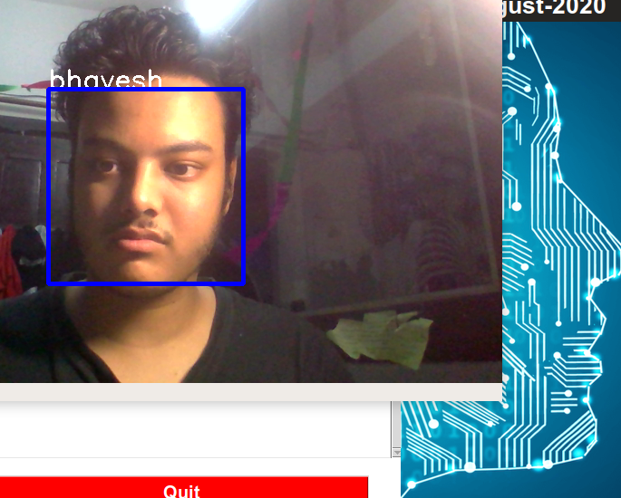<br/>
5. If the output value is more than 0.85(hardcoded) then a respective class is matched against that value.<br/>
6. I have created an empty dictionary initializing 0 values for all the students. Every time the face is matched with the label the value is incremented by 1 value. Once this value reached to 30(hardcoded) "Attendance is completed" is displayed on the header of the frame<br/>
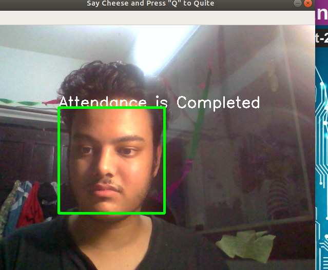<br/>
7. When the threshold reaches 30, for all the present students the data is updated in MongoDB table using Data.update
8. For MongoDB, the control is shifted to retrieve_pymongo_data.py where the Database and collections are pulled based on the subject and updated
9. Export CSV function saves the MongoDB data to CSV files for English and Hindi folders respectively.<br/>
<br/>
<br/>
10. "q" key on the keyboard can be used to exit the window.<br/>
11. Quit can be used to exit the Tkinter UI.<br/>


## **Project Structure**

```
├── api.py                     # REST API server (standalone)
├── app_web.py                 # Web application with Flask
├── config.py                  # Configuration settings
├── UI.py                      # Original Tkinter GUI
├── UI_modern.py              # Modern styled Tkinter GUI
├── Generate_Dataset.py        # Student enrollment & image capture
├── Model_train.py            # Model training script
├── Recognizer.py             # Face recognition & attendance marking
├── embedding.py              # FaceNet embedding extraction
├── align.py                  # Face alignment utilities
├── FaceDetection/            # Face detection module using Haar Cascade
├── Model/                    # Trained face recognition model
├── Model_architecture/       # Neural network architecture
├── MongoDB/                  # Database operations
├── PreTrained_model/        # FaceNet pre-trained model
├── Requirements/            # Dependency files
├── people/                  # Student image datasets
├── English_attendance/      # English lecture attendance records
├── Hindi_attendance/        # Hindi lecture attendance records
├── templates/               # HTML templates for web interface
├── static/                  # CSS and JavaScript files
└── images/                  # UI screenshots
```

## **Model Architecture**

The system uses a custom neural network built on top of FaceNet embeddings:

- **Input Layer:** 128 neurons (FaceNet embedding dimension)
- **Hidden Layers:** 
  - Layer 1: 64 neurons with LeakyReLU activation
  - Layer 2: 32 neurons with LeakyReLU activation
  - Layer 3: 16 neurons with LeakyReLU activation
- **Output Layer:** Softmax activation (number of classes = number of students)
- **Optimizer:** Adam with learning rate 0.01
- **Training:** 400 epochs, batch size 16

## **API Endpoints**

The system now includes a RESTful API for integration with other applications:

### Base URL: `http://localhost:5000/api`

**Health Check**
```
GET /api/health
Response: { "status": "running", "model_loaded": true, "mongodb_connected": true }
```

**Get All Students**
```
GET /api/students
Response: { "success": true, "count": 3, "students": [...] }
```

**Enroll Student**
```
POST /api/students
Body: { "name": "John Doe", "roll_number": "1" }
Response: { "success": true, "message": "Student enrolled successfully" }
```

**Get Attendance**
```
GET /api/attendance/{subject}
Response: { "success": true, "subject": "hindi", "records": [...] }
```

**Get Statistics**
```
GET /api/stats
Response: { "success": true, "stats": { "hindi": {...}, "english": {...} } }
```

**Export Attendance**
```
GET /api/attendance/{subject}/export
Response: CSV file download
```

## **Key Features Explained**

### Face Detection
- Uses OpenCV's Haar Cascade classifier for real-time face detection
- Processes video frames at 640x480 resolution
- Handles multiple faces in a single frame

### Face Recognition
- Leverages pre-trained FaceNet model for generating 128-dimensional embeddings
- Custom classifier trained on student embeddings
- Confidence threshold of 0.85 for recognition
- Prevents duplicate attendance marking in the same session

### Database Management
- MongoDB stores attendance records in separate collections per subject
- Automatic CSV export for easy data analysis
- Real-time updates during attendance marking

## **Limitations & Future Improvements**

- Accuracy depends heavily on lighting conditions
- Requires sequential roll number enrollment
- Currently supports 2 subjects (can be extended)
- No regularization in the model (can be added for larger datasets)

**Potential Enhancements:**
- ✨ Web-based interface (✅ Implemented)
- ✨ REST API for integrations (✅ Implemented)
- ✨ Modern UI styling (✅ Implemented)
- Add more subjects/lectures
- Implement data augmentation for better accuracy
- Add admin panel for attendance management
- Export to Excel format
- Email notifications for attendance reports
- Mobile app integration
- Real-time dashboard with charts
- Student photo gallery
- Attendance reports with date ranges

## **Contributing**

Contributions are welcome! Please feel free to submit a Pull Request.

## **License**

This project is licensed under the MIT License - see the [LICENSE](LICENSE) file for details.

## **Documentation**

- [API Documentation](API_DOCUMENTATION.md) - Complete REST API reference
- [Contributing Guidelines](CONTRIBUTING.md) - How to contribute to this project

## **Author**

**Tushar Sharma**  
GitHub: [@tusharsharma20021114](https://github.com/tusharsharma20021114)  
Repository: [rgbWeb-based-Smart-attendence-system-using-ML](https://github.com/tusharsharma20021114/rgbWeb-based-Smart-attendence-system-using-ML)

---

**Note:** This project demonstrates the practical application of machine learning and computer vision in automating attendance management systems. Developed with modern software engineering practices and extensible architecture.

## **Acknowledgments**

- FaceNet model for face embeddings
- OpenCV community for computer vision tools
- MongoDB for database solutions
- Flask framework for web development

## **Support**

If you find this project helpful, please ⭐ star the repository!

For issues and questions, please use the [GitHub Issues](https://github.com/tusharsharma20021114/rgbWeb-based-Smart-attendence-system-using-ML/issues) page.
